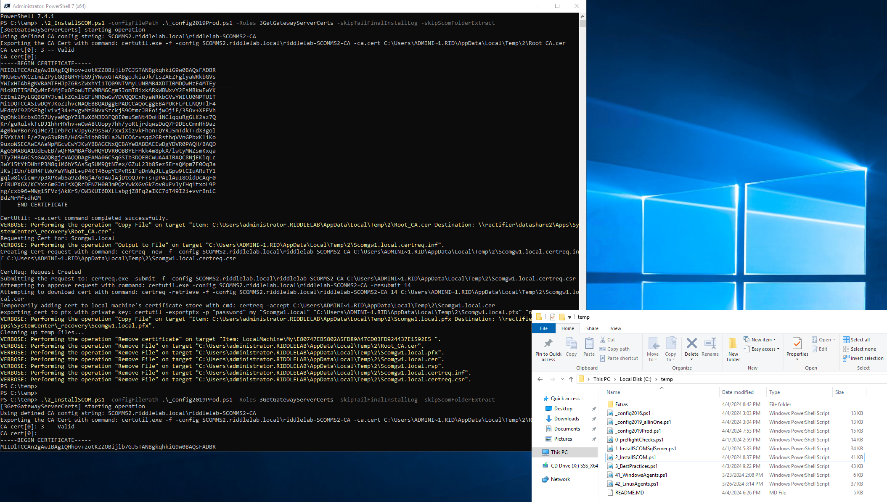

# New-ScomManagementGroup



# Introduction
New-ScomManagementGroup is a collection of Powershell scripts designed to help SCOM Admins deploy new SCOM components

- Mostly tested with SCOM/SQL/Windows 2019 and SCOM 2016, but should work with little modification on SCOM 2022+
- Inspired from original code used from these wonderful people:
  - Laurent VAN ACKER's original [Automated lab config](https://laurentvanacker.com/index.php/2021/02/16/scom2019-via-automatedlab/)
  - Blake Drumm's HyperV-based [AutomatedLab](https://github.com/blakedrumm/SCOM-Scripts-and-SQL/tree/master/AutomatedLab) and [Invoke-EnforceSCOMTLS1.2.ps1](https://github.com/blakedrumm/SCOM-Scripts-and-SQL/tree/master/Powershell/TLS%201.2%20Enforcement) script
  - Kevin Holman's [SCOM.Health](https://github.com/thekevinholman/SCOM.Health) and [SCOM.Management](https://github.com/thekevinholman/SCOM.Management)
  - Ola Hallengren's [SqlMaintenance solution](https://github.com/olahallengren/sql-server-maintenance-solution)

# Prerequisites: SCOM 2019 
- A config file that has the needed variables filled out (see the files named like _config*.ps1 for examples)
- An Active Directory server setup
- At least one [Windows Server](https://www.microsoft.com/en-us/evalcenter/evaluate-windows-server-2019) that:
  - we can install SCOM/SQL on 
  - Is joined to the Domain (or can be joined to the domain with credentials in the *$domainUser & $domainPass* variables) \
    `.\0_preflightChecks.ps1 -configFilePath .\_config2019Prod.ps1 -Operations JoinDomain`
  - Has Powershell 7 installed on the server(s)\
    ```iex "& { $(irm https://aka.ms/install-powershell.ps1) } -UseMSI"```
  - Is internet connected for downloading any prereqs, Powershell management modules, CU/UR updates, etc
  -  ***For production deployments, ensure the SQL server(s) have the proper number of drives and sizes \
        
        To Find your OpsDb/OpsDWH sizes, one can 
        1. use `.\Extras\System Center 2012 Operations Manager Sizing Helper Tool v1.xls` \
        1. Then input that into `driveSizer.ps1` to come up with rough sizes for *Ops_UserDb, Ops_UserLog, Ops_Tempdb & Dwh_UserDb, Dwh_UserLog, Dwh_Tempdb* drives:
            ```
            #Known desired OpsDB Size:
            computeSCOMDbSqlDriveSizes -opsDBDriveSize 32GB -TotalFreeSpace $null

            opsDBDrive              : 32
            OpsDbtempdbnLogDrive    : 6.4
            opsDbUserLogDrive       : 16
            totalOpsDbDriveSpaceSum : 54.4
            OriginalFreeSpace       : 0
            LeftOverFreeSpace       : 0
            OpsMgrBackupDrive       : 0
            OpsDWHbackupDrive       : 0
            OpsDWHUserDrive         : 379.821958456973
            OpsDWHUserLogDrive      : 37.9821958456973
            OpsDWHtempdbnLogDrive   : 75.9643916913947
            totalDWHDriveSpaceSum   : 493.768545994065
            ```

- The following binaries gathered and placed on an NAS share accessible to server(s):
 - [SQL Server 2019 ISO](https://go.microsoft.com/fwlink/?linkid=866664): \
    `Saved to the NAS location defined in config.ps1 variable: $SQLServerISO`
 - [System Center Operations Manager 2019 executable](https://www.microsoft.com/en-us/evalcenter/download-system-center-2019) : 
    
    `Saved to the NAS location defined in config.ps1 variable: $SCOMEXELocation` \
    OR \
    `Manually expanded a SCOM.EXE into a folder defined in config.ps1 variable: $SCOMSetupLocalFolder`

 - [SQL Server Management Studio](https://docs.microsoft.com/en-us/sql/ssms/download-sql-server-management-studio-ssms) : \
    `Saved to the NAS location defined in config.ps1 variable: $SSMSexeDir`
 - [SQL Server Reporting Services](https://www.microsoft.com/en-us/download/details.aspx?id=100122) : \
    `Saved to the NAS location defined in config.ps1 variable: $SsrsExeLocation`


# A typical install of SCOM goes like:

## Copy SCOM migration scripts to c:\temp after filing out the config.ps1 file and ensuring files are present at needed locations, user creds filled, etc.
```cd c:\temp```

## On all MS/GATEWAY/SQL servers, unblock files and setup dotnet prereqs, then reboot with (est. 15min complete):
```.\0_preflightChecks.ps1 -configFilePath .\_config2019Prod.ps1 -Operations UnblockFileWarnings,GetLatestDotnetFramework```

## On the SCOM webconsole, first install prereqs, then reboot (est. 5mins):
```.\0_preflightChecks.ps1 -configFilePath .\_config2019Prod.ps1 -Operations InstallWebConsolePreReqs```
 
## Note: you can reboot the servers after with:
```restart-computer -force```

## For SQL servers, install ssrs and dbengine(s), review logs, then reboot (est. 30min completion time):
```.\1_InstallSCOMSqlServer.ps1 -configFilePath .\_config2019Prod.ps1 -FEATURES ManagementTools,SQLEngine ```

## After rebooting, update SQL engine(s) to latest patch level with (est. 10mins):
```.\1_InstallSCOMSqlServer.ps1 -configFilePath .\_config2019Prod.ps1 -FEATURES UpdateToLatest ```


## On the FIRST Management Server (RMS), install with (est. 20 mins):
```.\2_InstallSCOM.ps1 -configFilePath .\_config2019Prod.ps1 -Roles OMConsole,OMServer```

## on the REPORTING Management Server, also install server role with (est 5 Mins):
```.\2_InstallSCOM.ps1 -configFilePath .\_config2019Prod.ps1 -Roles OMConsole,OMServer```

## On the Datawarehouse server, finish best SQL server best practices with (est. 30 min):
```.\3_BestPractices.ps1 -configFilePath .\_config2019Prod.ps1 -Operation SetSqlHighPerfPowerPlan,setTimeZone,setSystemLocaleENUS```
```.\3_BestPractices.ps1 -configFilePath .\_config2019Prod.ps1 -Operation PreSizeSCOMOpsDB,EnableOpsDBAutoGrowth,PreSizeSCOMOpsDWH,OpsDBEnableBroker,OpsDBEnableCLR ```

```.\3_BestPractices.ps1 -configFilePath .\_config2019Prod.ps1 -Operation SetDbsSqlMaintPlan # For sqlserver(s), MANUALLY schedule the sqlagent jobs timed properly```
```.\3_BestPractices.ps1 -configFilePath .\_config2019Prod.ps1 -Operation GetDbsDOPRecommend # MANUALLY Run the 'Change Script' recommended for sqlServers after consulting DBAs```

### note: This affects the opsdb and opsdwh server(s) 

## Still on DWH server, setup reporting with (est. 30 min):
```.\1_InstallSCOMSqlServer.ps1 -configFilePath .\_config2019Prod.ps1 -FEATURES RS,RSInit ## Ignore assembly errors. Look for IsInitialized=true```
```.\2_InstallSCOM.ps1 -configFilePath .\_config2019Prod.ps1 -Roles OMReporting,AddCustomReportExtensions```


## On the FIRST Management Server (RMS), install with (est. 20 mins):
```.\3_BestPractices.ps1 -configFilePath .\_config2019Prod.ps1 -Operation AutoApproveNewWinAgents,InitTLSSupport,ImportLogonasServicePack```

```.\3_BestPractices.ps1 -configFilePath .\_config2019Prod.ps1 -Operation ImportSelfMaintenanceMP # MANUALLY Review MP documentation and set overrides here```

```.\3_BestPractices.ps1 -configFilePath .\_config2019Prod.ps1 -Operation EnableScomLinuxMonitoring```


## AFTER all management servers are installed, run the following (est. 1 min): 
```.\2_InstallSCOM.ps1 -configFilePath .\_config2019Prod.ps1 -Roles addScomSDKSPNs```


## On ALL Management Servers and Gateways servers, run the following (est. 1 min):
```.\3_BestPractices.ps1 -configFilePath .\_config2019Prod.ps1 -Operation SetHealthServiceRegTweaks,setTimeZone,setSystemLocaleENUS```


## On designated Webconsole servers, install the webconsole role with (est. 20 mins):
```.\2_InstallSCOM.ps1 -configFilePath .\_config2019Prod.ps1 -Roles OMWebConsole```

# Gateways and Certificates
## Gateways: first install certificate authority if needed with (est. 5 min): 
```.\2_InstallSCOM.ps1 -configFilePath .\_config2019Prod.ps1 -Roles InstallStandAloneCA -skipTailFinalInstallLog -skipScomFolderExtract #this can go on a webconsole MS if desired.```

```.\3_BestPractices.ps1 -configFilePath .\_config2019Prod.ps1 -Operation SetWebBindingSSL #enable SSL / 443 for iis```

## Gateways: On any MS, pre-approve the gateways to be able to talk to upstream management servers with (est. 1 min):
```.\2_InstallSCOM.ps1 -configFilePath .\_config2019Prod.ps1 -Roles 1OMGatewayApprove -skipTailFinalInstallLog -skipScomFolderExtract```

## Gateways: On All Gateway server, install binaries with (est. 10 min):
```.\2_InstallSCOM.ps1 -configFilePath .\_config2019Prod.ps1 -Roles 2OMGateway```

## Gateways: generate & place individual Gateway certs (along with the CA cert) to $SCOMNasBackup with (est. 5 min): 
```.\2_InstallSCOM.ps1 -configFilePath .\_config2019Prod.ps1 -Roles 3GetGatewayServerCerts -skipTailFinalInstallLog -skipScomFolderExtract```

## Gateways: On All Management Servers and Gateway servers, trust the Root CA + import server cert with (est. 5 min):
```.\2_InstallSCOM.ps1 -configFilePath .\_config2019Prod.ps1 -Roles 4ImportGatewayServerCerts -skipTailFinalInstallLog -skipScomFolderExtract```

Note: You may need to manually copy certs to c:\temp first if the Gateway server is in an isolated network (see script for info)


## Optionally: On All Management Servers and Gateway servers, if you want to enforce higher TLS1.2 security, run (est. 10 min):
```.\3_BestPractices.ps1 -configFilePath .\_config2019Prod.ps1 -Operation EnforceTls12```

## Now manually go through all SCOM roles and update SCOM servers to UR=latest via windows update or KB MSIs (don't forget to download+import latest linux packs)

# Agents 
## Windows: dual-home Windows Agents with:
`.\41_WindowsAgents.ps1 -configFilePath .\_config2019Prod.ps1 -Operation AddNewWinAgentMG`

## Windows: After testing, remove the old Environment from Windows Agents with:
`.\41_WindowsAgents.ps1 -configFilePath .\_config2019Prod.ps1 -Operation RemoveOldWinAgentMG`

## Linux: dual-home Linux Agents with:
`.\42_LinuxAgents.ps1 -configFilePath .\_config2019Prod.ps1 -Operation AddAgentToMG`

## Linux: After testing, remove the old Environment from Linux Agents with:
`.\42_LinuxAgents.ps1 -configFilePath .\_config2019Prod.ps1 -Operation RemoveAgentFromOldMG`